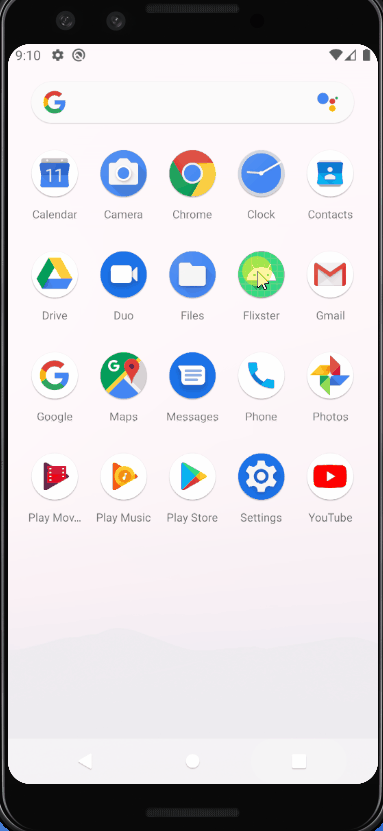

# Flixster
A movie scrolling app that allows users to browse movies from the [The Movie Database API](http://docs.themoviedb.apiary.io/#).

📝 `NOTE - PASTE PART 2 SNIPPET HERE:` Paste the README template for part 2 of this assignment here at the top. This will show a history of your development process, which users stories you completed and how your app looked and functioned at each step.

---

## Flix Part 1

### User Stories

#### REQUIRED (10pts)
- [x] (10pts) User can view a list of movies (title, poster image, and overview) currently playing in theaters from the Movie Database API.

#### BONUS
- [ ] (2pts) Views should be responsive for both landscape/portrait mode.
   - [ ] (1pt) In portrait mode, the poster image, title, and movie overview is shown.
   - [ ] (1pt) In landscape mode, the rotated alternate layout should use the backdrop image instead and show the title and movie overview to the right of it.

- [ ] (2pts) Display a nice default [placeholder graphic](https://guides.codepath.org/android/Displaying-Images-with-the-Glide-Library#advanced-usage) for each image during loading
- [ ] (2pts) Improved the user interface by experimenting with styling and coloring.
- [ ] (2pts) For popular movies (i.e. a movie voted for more than 5 stars), the full backdrop image is displayed. Otherwise, a poster image, the movie title, and overview is listed. Use Heterogenous RecyclerViews and use different ViewHolder layout files for popular movies and less popular ones.

### App Walkthough GIF
 

### Notes
- Ran into an exception running it the first time, since I ran the app before any network permissions were needed; solved by uninstalling (https://stackoverflow.com/questions/56266801/java-net-socketexception-socket-failed-eperm-operation-not-permitted?answertab=votes).
- Glide error: "Failed to find GeneratedAppGlideModule..." [Solution](https://stackoverflow.com/questions/49901629/glide-showing-error-failed-to-find-generatedappglidemodule) & [Another Link](https://bumptech.github.io/glide/doc/generatedapi.html)
- Last error: Getting Image sizes of the poster using the configurations API. Originally placed an asynchronous http client request to get the base URL (getting the secure http link, and the image size) for all posters inside of Movies.getPosterPath(). It was the wrong place to put it, since the function was required to return something, and there was no guarantee of a successful request immediately after sending one out. Solved by placing it as the first client request in MainActivity.java. Then, nested the second client request (to retrive "Now Playing" movies) inside of the try statement of the first client request.

### Open-source libraries used

- [Android Async HTTP](https://github.com/codepath/CPAsyncHttpClient) - Simple asynchronous HTTP requests with JSON parsing
- [Glide](https://github.com/bumptech/glide) - Image loading and caching library for Androids
